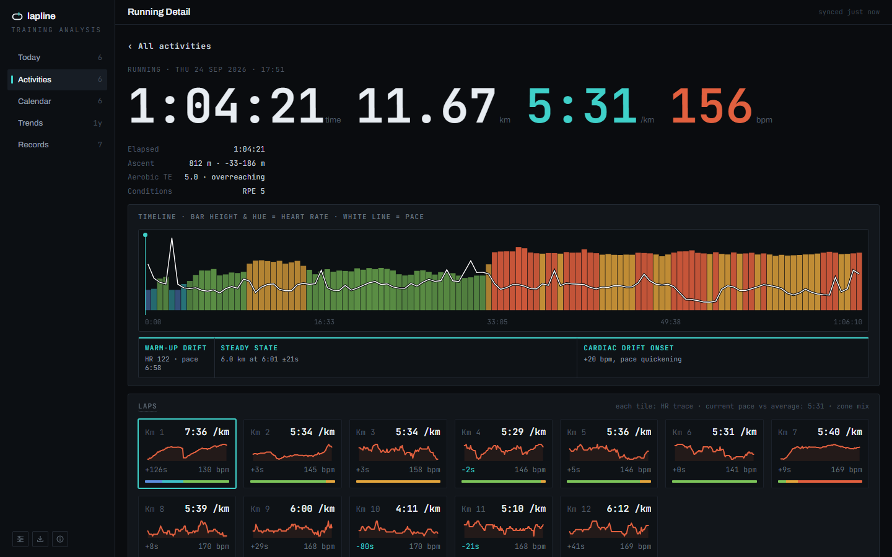

# Lapline

**Training analysis that stays on your device.** Drop in the `.fit` and `.gpx` files your watch or bike computer records and get training load, trends, personal records, heart-rate zones and per-lap detail for running, cycling and swimming. No account, and nothing is uploaded.

**Use it at [lapline.app](https://lapline.app).** It installs as an app (PWA) and works offline.



## Privacy

Your activity files are parsed in your browser and stored in your browser's own database (IndexedDB). They never leave your device, and there's no server that could receive them. Four optional features talk to the network, and all of them are **off until you turn them on** in Settings: anonymous usage analytics (SimpleAnalytics: which screens and features are used, never activity data), place names for activities (sends an activity's start coordinate to OpenStreetMap's Nominatim) weather (sends an activity's start coordinate and date to Open-Meteo) and map backgrounds (loads map images of a route's area from CARTO). To move to another browser or device, use Settings > Backup to export everything as one zip and restore it there.

## Development

Requires Node.js 20 or later.

```sh
npm install
npm run dev      # dev server at http://localhost:8080
npm test         # unit tests (vitest)
npm run check    # type check (svelte-check)
npm run build    # production build in dist/
```

Built with Svelte 5, TypeScript and Vite. Other scripts:

- `npm run icons` regenerates the app icons in `public/icons/`.
- `npm run build:perf` builds and then writes a performance report (bundle sizes and benchmarks, compared with the last report) to `reports/`; `npm run perf` reruns the report against the existing `dist/`. Deploys use the plain `npm run build`, without the benchmarks.
- `test-fixtures/` holds anonymised real recordings used by the tests, and `public/demo/` holds the sample sessions behind "Try it with sample data". Both were made from real files by `scripts/demo/` (routes trimmed at both ends and moved, altitudes and dates shifted by secret random amounts, serial numbers and profile data removed).

## Health disclaimer

Lapline's estimates (VO₂ max, training effect, recovery time, training load) are training guidance, not medical advice.

## Feedback

Bugs, files that won't import, ideas: email [hello@lapline.app](mailto:hello@lapline.app) or [open an issue](https://github.com/Mikea15/lapline.app/issues). Updates: [@laplineapp](https://x.com/laplineapp) on X.

## Support

Lapline is free and has no ads. If it's useful to you, you can [buy me a coffee](https://buymeacoffee.com/mikea15).

## Licence

[MIT](LICENSE)
